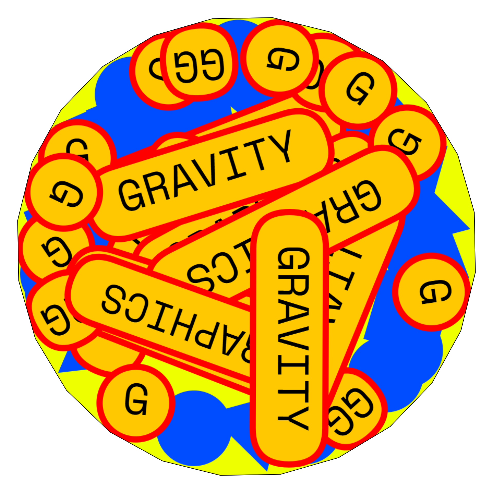

<p align="center">
  
</p>

<h1 align="center">Graphics Gravity</h1>

<p align="center">
  A 2D physics playground for type, shapes, PNGs and SVGs.<br>
  Drop graphics into a rotating container, direct the motion and export the result.
</p>

<p align="center">
  <a href="https://ycswu.co/graphics-gravity/">Website</a> ·
  <a href="https://github.com/aliguzel996/graphics-gravity">GitHub</a> ·
  <a href="#development">Development</a>
</p>

## What it does

Graphics Gravity turns text and graphic assets into physical 2D objects. Every piece can fall, roll, collide and react to the other pieces while the surrounding container remains still or rotates around them.

The same tool runs in a modern web browser and as a Windows desktop application. Projects can be saved as `.graphicsGravity` files and reopened later without rebuilding the scene from scratch.

## Features

### Inputs

- Add unrestricted text, circles, squares, triangles and stars.
- Choose Space Mono, Helvetica/Arial or an italic script font for text inputs.
- Import custom TTF, OTF, WOFF and WOFF2 fonts; custom fonts remain embedded in saved projects and SVG exports.
- Import PNG and SVG artwork.
- Transparent image regions are excluded from the physical silhouette instead of behaving like a solid rectangular image box.
- Reorder the input queue by dragging its cards.
- Click a card to make it the next piece dropped into the scene.
- Drop one piece with a click or continuously emit pieces while holding the pointer.
- Control the hold-to-drop rate.

### Piece controls

- Change the size of every piece globally.
- Give each input its own size.
- Optionally apply an input-specific size change to its existing copies.
- Randomize every new drop inside a configurable minimum and maximum size range.
- Reset selected and random sizes to 100% with one click.

### Containers

- Circle and custom polygons with 3–64 sides.
- A 3-sided circle becomes a triangle; a 4-sided circle becomes a square.
- Independent long-side and short-side controls for rectangular containers.
- Draw a custom container directly in the preview.
- Show or hide the container outline in the output.
- Adjust the outline thickness.
- Rotate the container automatically in either direction with adjustable speed.
- Pieces are kept inside the physical boundary. When the front layer is full, overflow can move to a rear layer instead of escaping through the edges.

### Physics

- Adjustable gravity.
- Adjustable bounciness.
- Adjustable friction for sliding and settling behavior.
- Optional mutual attraction between pieces.
- Full piece-to-piece and piece-to-container collision.

### Appearance

- Color and alpha controls for the preview, container, text, text background, text border and vector inputs.
- Per-input vector color and transparency.
- Independent optional outlines for shape/SVG inputs and text, each with its own color, alpha and thickness.
- Adjustable text background, border thickness and corner radius.
- A 100% corner radius turns a single-character text piece into a true circle.
- Optional fine preview grid for checking transparent areas. It starts hidden and fills the complete preview surface when enabled.

### Preview and export

- Collapsible sidebar sections keep the canvas clear; all sections start closed.
- The empty opening container displays a one-time interaction hint that disappears on the first drop.
- Vector-sharp preview zoom from 50% to 300% with the mouse wheel.
- Free, `1920 × 1920` and vertical `1080 × 1920` output frames.
- Exports use the exact frame and zoom currently visible in the preview.
- PNG export with real transparency.
- SVG export with editable vector geometry, opacity and outlines.
- JPG export flattened onto the selected preview background because JPEG does not support transparency.
- Live WebM recording.
- Optional 30 FPS PNG-sequence ZIP after recording.

## Project files

Use **Save** or `Ctrl/Cmd + S` to create a `.graphicsGravity` project. Use **Open**, `Ctrl/Cmd + O`, or drag a project file onto the application to continue later.

The installed Windows build registers the project-file icon and association. The portable build does not install a Windows file association, so portable projects should be opened from inside Graphics Gravity or dragged onto its window.

## Web deployment

Graphics Gravity is a static web application and does not need a database or server-side runtime.

1. Run `npm run build:web`.
2. Upload the contents of `dist/` to the desired public directory.
3. Keep `assets/`, `vendor/`, `graphics-gravity-icon.png` and `index.html` together.

For cPanel, run `npm run build:web:cpanel` and upload the contents of `dist-cpanel/`. This flat build deliberately contains no nested asset directories, avoiding hosting file managers that extract ZIP paths as literal backslash filenames. Keep the included `.htaccess`; it supplies safe JavaScript and CSS MIME mappings for Apache.

## Windows builds

Two Windows x64 packages are produced:

- `graphics-gravity-setup-0.2.2-x64.exe` — standard installer with project-file association.
- `graphics-gravity-portable-0.2.2-x64.exe` — runs without installation.

Windows 10 or newer is recommended.

## Development

Requirements:

- Node.js 20 or newer
- npm

Install and start the development server:

```bash
npm install
npm run dev
```

Create the production web build:

```bash
npm run build:web
```

Build the Windows installer and portable executable:

```bash
npm run dist:win
```

Build outputs:

```text
dist/             Web application
release/windows/  Windows installer and portable executable
```

## Technology

- Vanilla JavaScript and Canvas
- Matter.js for 2D physics
- Vite for the web build
- Electron and electron-builder for Windows packaging

## License

Released under the [MIT License](package.json).

## Credits

Created by **Ali Güzel** and published by **YCSWU**.

Graphics Gravity is part of the YCSWU Tools collection.
